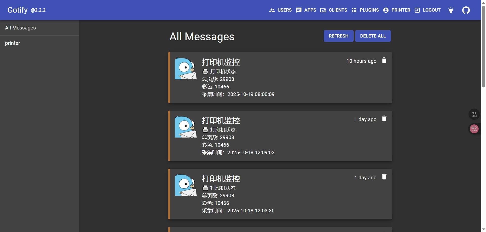

pip install DrissionPage -i https://mirrors.aliyun.com/pypi/simple

pip install openpyxl requests -i https://mirrors.aliyun.com/pypi/simple

pip install selenium -i https://mirrors.aliyun.com/pypi/simple

pip install bs4 -i https://mirrors.aliyun.com/pypi/simple

C:\Users\admin\AppData\Local\Google\Chrome\Application\chrome.exe  --remote-debugging-port=9222 --user-data-dir="C:/temp/chrome_debug"

C:\Users\admin\AppData\Local\Google\Chrome\Application\chrome.exe --remote-debugging-port=9222 --user-data-dir="C:\selenum\ChromeData"